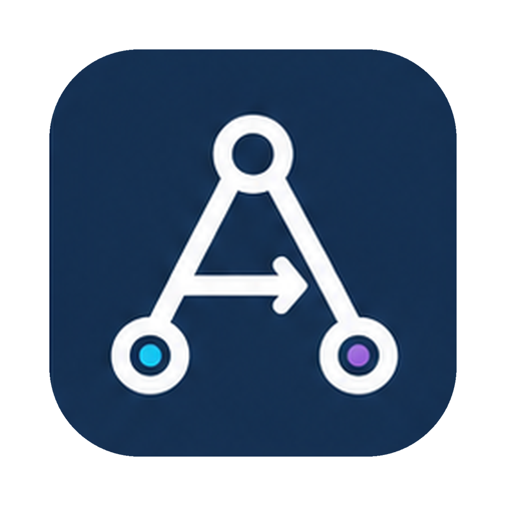

<p align="right">
<a href="./README.md">English</a> | <a href="./docs/README_zh.md">中文</a>
</p>

<h1 align="center">
<br/>
Agentre
</h1>

<p align="center">A local-first desktop workspace for coordinating Claude Code, Codex, and other AI coding agents across projects, sessions, and remote machines.</p>

<p align="center">
  
  &nbsp;
  
  &nbsp;
  
  &nbsp;
  
</p>

## About

AI coding work rarely fits inside one terminal tab anymore. A real workday may have one agent fixing backend behavior, another reviewing a frontend change, a third investigating a production log, and a fourth waiting for tool approval.

Agentre gives that workflow one desktop home. Each **Agent** has a role, avatar, system prompt, skills, and backend engine. Agents live inside **Departments**, work inside **Projects**, and run many **Sessions** in parallel. The app is built for quickly seeing what is running, what is waiting, and where to jump next.

**If you find it useful, please give us a Star ⭐ — it means a lot!**

## What You Can Do

- **Run multiple coding agents side by side**: keep frontend, backend, reviewer, release, or ops agents active at the same time without losing their individual context.
- **Choose the engine per agent**: assign Claude Code, Codex, or a built-in engine to each agent while keeping the same chat workflow.
- **Organize work by project**: group sessions, members, and agents around a codebase or initiative so recent work is easy to scan.
- **Switch fast with the command palette**: use `⌘K` to open chats, jump between sessions, change projects, and trigger agent actions from the keyboard.
- **Review tool activity in place**: file edits, shell commands, MCP calls, permission prompts, and ask-user questions appear as explicit in-app cards.
- **Run sessions on another machine**: pair a LAN `agentred` daemon and run agent work on a remote dev box while approvals stay in the desktop app.
- **Keep long tasks manageable**: queued messages, active-session indicators, abort/resume controls, and waiting states make parallel work easier to supervise.

## App Surfaces

| Area | What it is for |
| ---- | -------------- |
| **Chat** | Drive agent sessions, inspect tool calls, approve actions, queue follow-up messages, and resume interrupted work. |
| **Board** | Track issues and hand off focused tasks to agents; replying on an issue can create a linked session. |
| **Org** | Model agents as departments and sub-departments, with leads, colors, and role-specific profiles. |
| **Hooks** | Route external triggers such as webhooks, notifications, timers, or messages into agent workflows. |
| **Settings** | Configure agent backends, remote devices, project membership, and session permission modes. |

## Core Concepts

| Concept | What it means |
| ------- | ------------- |
| **Agent** | A role + avatar + system prompt + skills + backend engine. An agent can run many sessions. |
| **Department** | A nested organizational container for agents, with an optional lead and theme color. |
| **Session** | One conversation or task run, with states such as `running`, `waiting`, and `idle`. |
| **Project** | A workspace scope for a codebase or initiative, bundling members, agents, and sessions. |
| **Issue** | A standalone ticket that can be assigned to an agent and linked to a session. |
| **Hook** | An external event source that can dispatch work to agents through routing rules. |

## Remote Execution

Agentre includes `agentred`, a companion daemon for running sessions on another Linux or macOS machine on your LAN.

1. Open **Settings → Remote devices** and pair an `agentred` daemon.
2. Open **Settings → Agent backends** and create a backend whose run device is the paired machine.
3. In **Project → Settings → Members**, add an agent that uses that backend and points to the working path on the remote machine.
4. Start a chat from the command palette. The session runs remotely, and the desktop app still shows tool approvals, questions, status, and output.

## Desktop Workflow

- **64px icon rail** for Chat, Board, Org, Hooks, and Settings.
- **Agent chat list** with pinned agents, active-session dots, and inline session counts.
- **Project sessions view** for scanning recent work by project instead of by agent.
- **Permission mode chooser** before a session starts touching files or running tools.
- **Inline subagent/tool cards** so shell, file, and MCP activity is inspectable without reading raw logs.
- **Keyboard-first navigation** for moving across agents, projects, and sessions quickly.

## Development

**Prerequisites:** [Go 1.26+](https://go.dev/), [Node.js 22+](https://nodejs.org/) with [pnpm](https://pnpm.io/), and the [Wails v2 CLI](https://wails.io/docs/gettingstarted/installation).

```bash
make install-deps    # Install frontend dependencies
make dev             # Development mode with hot reload
make test            # Backend race tests + frontend Vitest
make build           # Production build for the current platform
make install         # Install the app bundle (macOS: /Applications/Agentre.app)
```

To target another macOS install location:

```bash
make install MACOS_APP_INSTALL_DIR="$HOME/Applications"
```

## Contributing

Issues and pull requests are welcome. See [CLAUDE.md](./CLAUDE.md) for repository conventions, architecture, TDD discipline, and commit style.

## License

Released under [GPLv3](./LICENSE).
